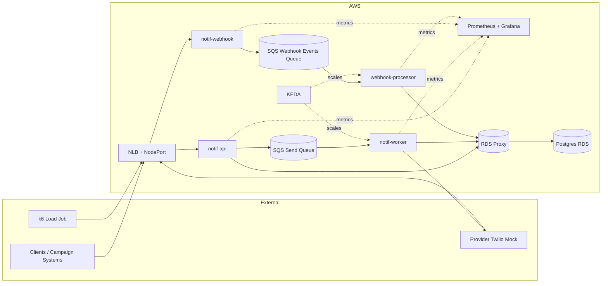

# 01) System Context

```mermaid
flowchart LR
    subgraph ext[External]
      users[Clients / Campaign Systems]
      k6[k6 Load Job]
    provider["Provider Twilio Mock"]
    end

    subgraph aws[AWS]
      ingress[NLB + NodePort]
      api[notif-api]
      worker[notif-worker]
      webhook[notif-webhook]
      whproc[webhook-processor]
      keda[KEDA]
      mon[Prometheus + Grafana]

      qsend[(SQS Send Queue)]
      qwebhook[(SQS Webhook Events Queue)]
      dbproxy[(RDS Proxy)]
      db[(Postgres RDS)]
    end

    users --> ingress --> api
    k6 --> ingress

    api --> qsend
    qsend --> worker
    worker --> provider

    provider --> ingress --> webhook
    webhook --> qwebhook
    qwebhook --> whproc

    api --> dbproxy --> db
    worker --> dbproxy
    whproc --> dbproxy

    keda -. scales .-> worker
    keda -. scales .-> whproc

    api -. metrics .-> mon
    worker -. metrics .-> mon
    webhook -. metrics .-> mon
    whproc -. metrics .-> mon
```
