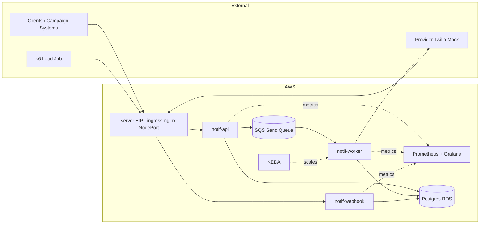

# 01) System Context

No load balancer (the account cannot create them; DNS points at the server
EIP), no RDS Proxy (each service's pgx pool talks to Postgres directly), no
webhook queue (the webhook handler applies the status update in one
statement). The pre-2026-08-20 topology these replaced is recorded in the
campaign docs.
