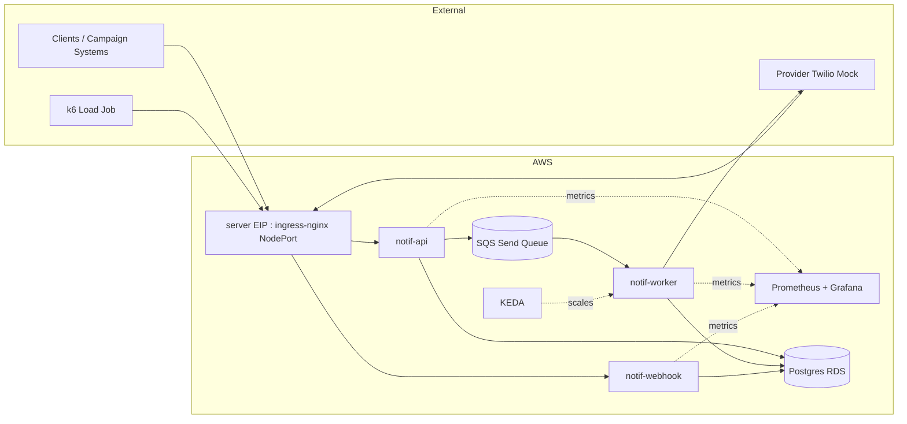

# 01) System Context

```mermaid
flowchart LR
    subgraph ext[External]
      users[Clients / Campaign Systems]
      k6[k6 Load Job]
      provider["Provider Twilio Mock"]
    end

    subgraph aws[AWS]
      entry["server EIP : ingress-nginx NodePort"]
      api[notif-api]
      worker[notif-worker]
      webhook[notif-webhook]
      keda[KEDA]
      mon[Prometheus + Grafana]

      qsend[(SQS Send Queue)]
      db[(Postgres RDS)]
    end

    users --> entry --> api
    k6 --> entry

    api --> qsend
    qsend --> worker
    worker --> provider

    provider --> entry --> webhook

    api --> db
    worker --> db
    webhook --> db

    keda -. scales .-> worker

    api -. metrics .-> mon
    worker -. metrics .-> mon
    webhook -. metrics .-> mon
```

How to read the diagram:

- Clients, campaign systems and the k6 load job reach the server EIP. The
  EIP leads to an ingress-nginx NodePort, which routes requests to
  `notif-api`.
- `notif-api` writes to Postgres (RDS) and puts messages on the SQS send
  queue.
- `notif-worker` reads the send queue and calls the provider, a Twilio mock.
  It also writes to Postgres.
- The provider sends status callbacks back through the same entry point. They
  reach `notif-webhook`, which writes the status to Postgres.
- KEDA scales `notif-worker`.
- All three services send metrics to Prometheus and Grafana.

Three parts are not in this topology:

- **No load balancer.** The account cannot create them, so DNS points at the
  server EIP.
- **No RDS Proxy.** Each service's pgx pool talks to Postgres directly.
- **No webhook queue.** The webhook handler applies the status update in one
  statement.

The campaign docs record the pre-2026-08-20 topology that these choices
replaced.
