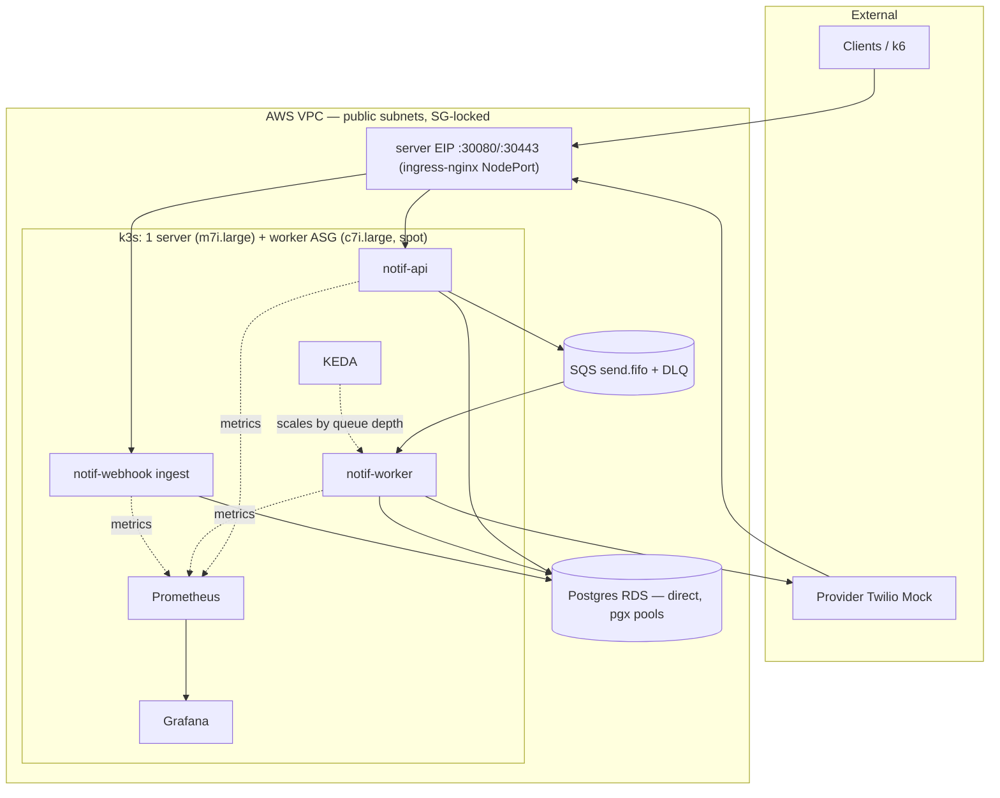

# 02) Container / Runtime View

Access for operators is SSM (no bastion, no SSH required); kubectl reaches
the server EIP on 6443, SG-locked to the admin CIDR. SQS is reached via the
internet gateway (public subnets — no NAT, so no per-GB toll on the
worker→SQS path).
