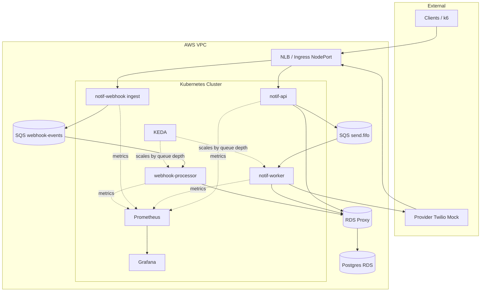

# 02) Container / Runtime View

```mermaid
flowchart TB
  subgraph ext[External]
    client[Clients / k6]
    provider["Provider Twilio Mock"]
  end

  subgraph aws[AWS VPC]
    nlb[NLB / Ingress NodePort]

    subgraph k8s[Kubernetes Cluster]
      api[notif-api]
      worker[notif-worker]
      webhook["notif-webhook ingest"]
      whproc[webhook-processor]
      keda[KEDA]
      prom[Prometheus]
      grafana[Grafana]
    end

    qsend[(SQS send.fifo)]
    qwebhook[(SQS webhook-events)]
    dbproxy[(RDS Proxy)]
    db[(Postgres RDS)]
  end

  %% ingress and request path
  client --> nlb
  nlb --> api
  provider --> nlb
  nlb --> webhook

  %% message processing
  api --> qsend
  qsend --> worker
  worker --> provider

  %% webhook processing
  webhook --> qwebhook
  qwebhook --> whproc

  %% data path
  api --> dbproxy --> db
  worker --> dbproxy
  whproc --> dbproxy

  %% control and observability
  keda -. scales by queue depth .-> worker
  keda -. scales by queue depth .-> whproc

  api -. metrics .-> prom
  worker -. metrics .-> prom
  webhook -. metrics .-> prom
  whproc -. metrics .-> prom
  prom --> grafana
```
