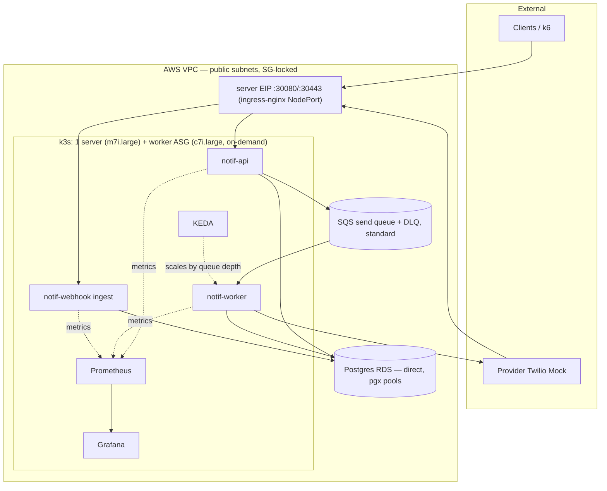

# 02) Container / Runtime View

```mermaid
flowchart TB
  subgraph ext[External]
    client[Clients / k6]
    provider["Provider Twilio Mock"]
  end

  subgraph aws[AWS VPC — public subnets, SG-locked]
    entry["server EIP :30080/:30443 (ingress-nginx NodePort)"]

    subgraph k8s["k3s: 1 server (m7i.large) + worker ASG (c7i.large, on-demand)"]
      api[notif-api]
      worker[notif-worker]
      webhook["notif-webhook ingest"]
      keda[KEDA]
      prom[Prometheus]
      grafana[Grafana]
    end

    qsend[(SQS send queue + DLQ, standard)]
    db[(Postgres RDS — direct, pgx pools)]
  end

  %% ingress and request path
  client --> entry
  entry --> api
  provider --> entry
  entry --> webhook

  %% message processing
  api --> qsend
  qsend --> worker
  worker --> provider

  %% data path
  api --> db
  worker --> db
  webhook --> db

  %% control and observability
  keda -. scales by queue depth .-> worker

  api -. metrics .-> prom
  worker -. metrics .-> prom
  webhook -. metrics .-> prom
  prom --> grafana
```

The diagram shows three paths:

- **Requests:** clients reach `notif-api` through the ingress-nginx NodePort
  (ports 30080/30443) on the server EIP (Elastic IP, a fixed public address).
  The provider reaches the webhook ingest service through the same entry
  point.
- **Messages:** `notif-api` puts messages on the SQS send queue.
  `notif-worker` reads from that queue and calls the provider. KEDA scales
  the worker by queue depth.
- **Data and metrics:** all three services connect to Postgres RDS directly
  through pgx pools. Each service exposes metrics to Prometheus, and Grafana
  reads from Prometheus.

How operators and the services reach the cluster and AWS:

- Operators get access through SSM (AWS Systems Manager). There is
  no bastion host, and SSH is not required.
- `kubectl` reaches the server EIP on port 6443. The security group (SG)
  allows that port only from the admin CIDR.
- SQS is reached through the internet gateway, because the nodes sit in
  public subnets. There is no NAT gateway, so the worker-to-SQS
  path carries no NAT charge, which AWS bills per GB.
