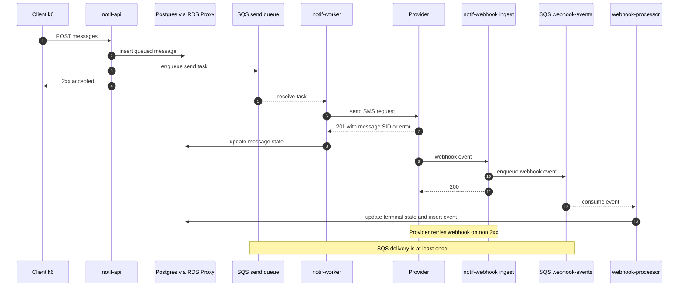

# 03) Message Lifecycle Sequence

```mermaid
sequenceDiagram
    autonumber
    participant C as Client k6
    participant API as notif-api
    participant DB as Postgres via RDS Proxy
    participant Q1 as SQS send queue
    participant W as notif-worker
    participant P as Provider
    participant WH as notif-webhook ingest
    participant Q2 as SQS webhook-events
    participant WHP as webhook-processor

    C->>API: POST messages
    API->>DB: insert queued message
    API->>Q1: enqueue send task
    API-->>C: 2xx accepted

    Q1-->>W: receive task
    W->>P: send SMS request
    P-->>W: 201 with message SID or error
    W->>DB: update message state

    P->>WH: webhook event
    WH->>Q2: enqueue webhook event
    WH-->>P: 200
    Q2-->>WHP: consume event
    WHP->>DB: update terminal state and insert event

    Note over P,WH: Provider retries webhook on non 2xx
    Note over Q1,Q2: SQS delivery is at least once
```
