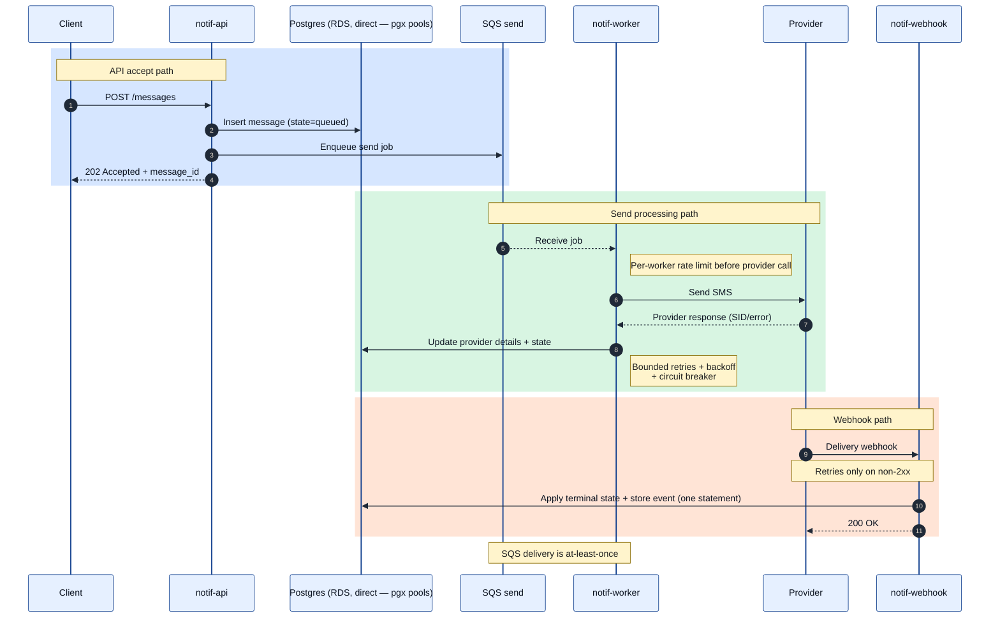

# 03) Message Lifecycle Sequence

```mermaid
%%{init: {
  "theme": "base",
  "themeVariables": {
    "fontFamily": "Inter, Segoe UI, Arial, sans-serif",
    "fontSize": "18px",
    "primaryTextColor": "#0b1220",
    "lineColor": "#1f2937",
    "actorTextColor": "#0b1220",
    "actorBorder": "#0b3b8c",
    "actorBkg": "#e6f0ff",
    "signalColor": "#1f2937",
    "signalTextColor": "#0b1220",
    "labelBoxBkgColor": "#e6f0ff",
    "labelBoxBorderColor": "#0b3b8c",
    "noteBkgColor": "#fff4cc",
    "noteBorderColor": "#8a6d00",
    "noteTextColor": "#1f1f1f"
  }
}}%%
sequenceDiagram
    autonumber
    participant C as Client
    participant API as notif-api
    participant DB as Postgres (RDS, direct — pgx pools)
    participant QSend as SQS send
    participant W as notif-worker
    participant P as Provider
    participant WH as notif-webhook

    rect rgb(214, 230, 255)
    Note over C,API: API accept path
    C->>API: POST /messages
    API->>DB: Insert message (state=queued)
    API->>QSend: Enqueue send job
    API-->>C: 202 Accepted + message_id
    end

    rect rgb(216, 245, 226)
    Note over QSend,P: Send processing path
    QSend-->>W: Receive job
    Note right of W: Per-worker rate limit before provider call
    W->>P: Send SMS
    P-->>W: Provider response (SID/error)
    W->>DB: Update provider details + state
    Note right of W: Bounded retries + backoff<br/>+ circuit breaker
    end

    rect rgb(255, 228, 214)
    Note over P,WH: Webhook path
    P->>WH: Delivery webhook
    Note over P,WH: Retries only on non-2xx
    WH->>DB: Apply terminal state + store event (one statement)
    WH-->>P: 200 OK
    end

    Note over QSend,W: SQS delivery is at-least-once
```
