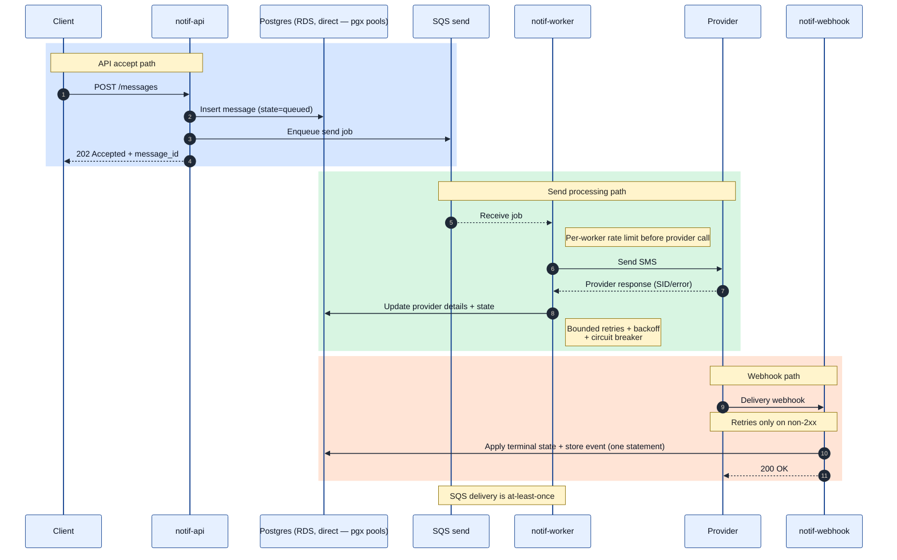

# 03) Message Lifecycle Sequence

## What the worker tells the queue

SQS deletes a job only when the worker's handler returns nil. The return value
is therefore an instruction to the queue — *finished* or *not finished* — and
it must agree with what the worker wrote to Postgres. A row the database calls
final cannot be re-claimed, so asking SQS to redeliver it achieves nothing.

| Outcome of one delivery | Row afterwards | Handler returns | Queue then |
|---|---|---|---|
| Provider accepted the send | `submitted` | nil | deletes the job |
| Provider rejected permanently (e.g. 400) | `failed` | nil | deletes the job |
| Temporary failure after 3 in-process attempts (429, 5xx, timeout, refused) | released to `queued` | error | redelivers after the visibility timeout; DLQ after 5 receives |
| Provider says our configuration is wrong (401, 403, 404) | released to `queued` | error | same as above — a bad deploy must not fail messages permanently |
| Circuit breaker open | released to `queued` | error | same as above |
| Template missing (likely a bad deploy) | released to `queued` | error | same as above; redrive once fixed |
| Duplicate delivery of a finished message (`submitted`, `delivered`, `failed`, `suppressed`) | unchanged | nil | deletes the job |
| Duplicate delivery while another worker still holds the row | unchanged | error (`ErrHeldElsewhere`) | redelivers; acknowledged once the holder finishes |
| Sent, but the claim was lost before the result was recorded | attempt recorded; row left to its new owner | nil | deletes the job |
| Job names a message that does not exist | — | error | redelivers, then dead-letters, so it is visible |
| Database write failed | unchanged | error | redelivers |

Every write on a claimed row carries the claim's token (the `updated_at` the
claim wrote) and applies only while the row is still `processing` under it, so
a worker whose claim went stale cannot overwrite the new holder's result or a
`delivered` the webhook already wrote.

Rule: **never return an error after writing a terminal state, and never return
nil while the job still needs a send.** See
[the failure-handling runs](../campaign-100k/retry-handling-ab-2026-08-15.md)
for what breaking it cost.

