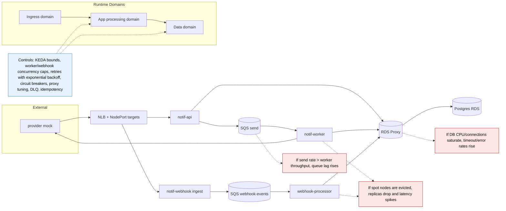

# 04) Scaling and Failure Domains

Backpressure operating rule:
- Tune `notif-worker` and `webhook-processor` concurrency and autoscaling bounds based on queue lag and DB headroom, so backlog is absorbed in SQS while `Postgres/RDS Proxy` and downstream dependencies stay within safe CPU, connection, and timeout limits.
- Keep retries bounded with exponential backoff and use circuit breakers to fail fast during sustained downstream failures, preventing retry storms from exhausting DB and compute resources.
