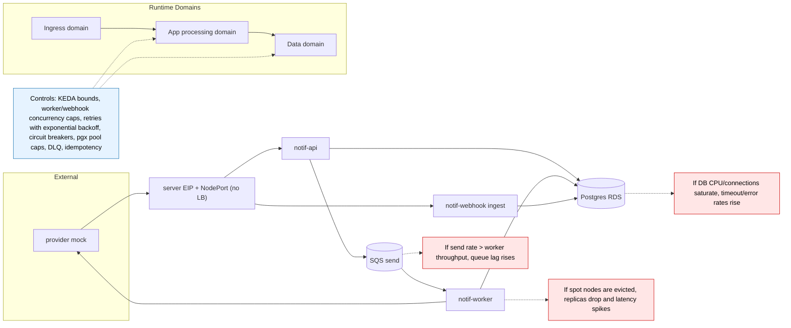

# 04) Scaling and Failure Domains

Backpressure operating rule:
- Tune `notif-worker` concurrency and autoscaling bounds based on queue lag and DB headroom, so backlog is absorbed in SQS while Postgres and downstream dependencies stay within safe CPU, connection, and timeout limits.
- Keep retries bounded with exponential backoff and use circuit breakers to fail fast during sustained downstream failures, preventing retry storms from exhausting DB and compute resources.

How this scales (and what it costs today by not pre-building it):
- Workers scale by one variable (`worker_count`; KEDA scales pods within the
  pool). A measurement-grade pool is `worker_on_demand_percentage = 100`.
- The single k3s server is the availability trade: control plane and ingress
  entry ride one instance (its EIP survives replacement; ~5 min to recreate
  from Terraform). If that ever stops being acceptable, the upgrade path is
  the machinery deliberately removed on 2026-08-20: 3 servers with etcd, a
  join endpoint, and a load balancer in front of ingress — reintroduce it
  when the requirement is real, not before.
