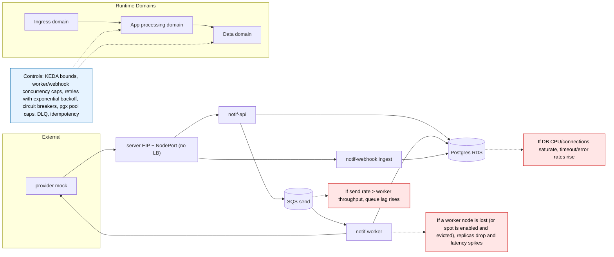

# 04) Scaling and Failure Domains

This page shows how the system scales and where it can fail. It also lists
the controls that limit those failures.

```mermaid
flowchart LR
  subgraph ext[External]
    mock[provider mock]
  end

  subgraph domains[Runtime Domains]
    ingress[Ingress domain]
    app[App processing domain]
    data[Data domain]
  end

  ingress --> app --> data

  entry["server EIP + NodePort (no LB)"]
  api[notif-api]
  webhook[notif-webhook ingest]
  worker[notif-worker]
  qsend[(SQS send)]
  db[(Postgres RDS)]

  entry --> api
  entry --> webhook
  api --> qsend --> worker --> mock
  mock --> entry
  api --> db
  worker --> db
  webhook --> db

  classDef risk fill:#ffe6e6,stroke:#c00,color:#000;
  classDef ctrl fill:#e6f3ff,stroke:#1f78b4,color:#000;

  overload_worker["If send rate > worker throughput, queue lag rises"]:::risk
  overload_db["If DB CPU/connections saturate, timeout/error rates rise"]:::risk
  spot_loss["If a worker node is lost (or spot is enabled and evicted), replicas drop and latency spikes"]:::risk
  controls["Controls: KEDA bounds, worker/webhook concurrency caps, retries with exponential backoff, circuit breakers, pgx pool caps, DLQ, idempotency"]:::ctrl

  qsend -.-> overload_worker
  db -.-> overload_db
  worker -.-> spot_loss
  controls -.-> app
  controls -.-> data
```

How to read the diagram:
- The "Runtime Domains" box names the three failure domains: ingress, app
  processing, and data. It is a summary, so its nodes are not wired to the
  components (`notif-api`, SQS, Postgres) next to it.
- Red nodes are failure risks. The blue node lists the controls, which apply
  to the app processing and data domains.

Backpressure operating rule:
- Tune `notif-worker` concurrency and autoscaling bounds based on queue lag
  and DB headroom. The backlog then waits in SQS, while Postgres and
  downstream dependencies stay within safe CPU, connection, and timeout
  limits.
- Keep retries bounded with exponential backoff, and use circuit breakers to
  fail fast during sustained downstream failures. Together these stop retry
  storms from exhausting DB and compute resources.

How this scales, and what it costs today not to build more in advance:
- Workers scale by one variable (`worker_count`; KEDA scales pods within the
  pool).
- Workers are on-demand (`workers_use_spot = false`). This is the default,
  and the only option this account's spot quota allows.
- A spot pool is a one-variable change once the quota is raised. The cost is
  interruption risk.
- The single k3s server is the availability trade. The control plane and the
  ingress entry both run on one instance. Its EIP survives replacement, and
  the instance takes ~5 min to recreate from Terraform.
- If the single-server trade ever stops being acceptable, the upgrade path
  is the machinery deliberately removed on 2026-08-20. That machinery is 3
  servers with etcd, a join endpoint, and a load balancer in front of
  ingress. Reintroduce it when the requirement is real, not before.
